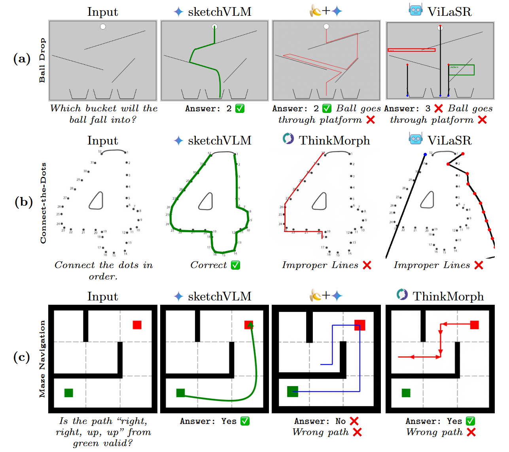
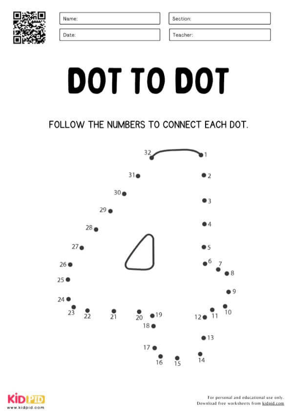
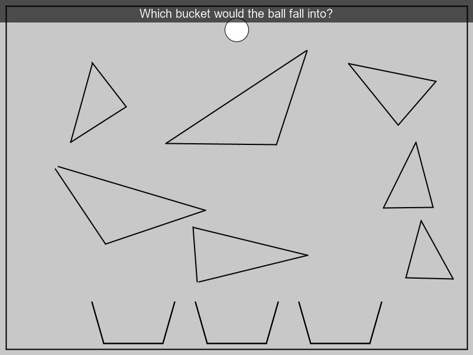
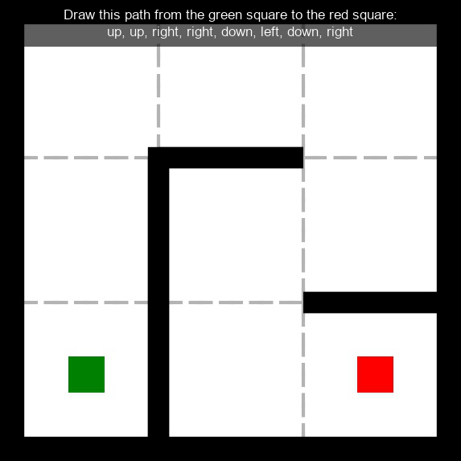

# SketchVLM: Vision Language Models Can Annotate Images to Explain Thoughts and Guide Users

<div align="center">    

by  [Brandon Collins](https://brandon-collins7.github.io/)<sup>1</sup>, [Logan Bolton](https://loganbolton.github.io/)<sup>1</sup>, Hung Huy Nguyen<sup>1</sup>, [Mohammad Taesiri](https://taesiri.ai/)<sup>2</sup>, [Trung Bui](https://sites.google.com/site/trungbuistanford/)<sup>3</sup>, [Anh Nguyen](https://anhnguyen.me/research/)<sup>1</sup>

<sup>1</sup>Auburn University, <sup>2</sup>Independent, <sup>3</sup>Adobe

[](https://sketchvlm.github.io/) [](https://arxiv.org/abs/2604.22875) [](https://github.com/LoganBolton/SketchVLM_Demo) [](https://huggingface.co/collections/loganbolton/sketchvlm)

### 👉 [Try the Interactive Demo!](https://sketch-vlm-demo.vercel.app/) 👈

</div>

```bibtex
@misc{collins2026sketchvlmvisionlanguagemodels,
      title={SketchVLM: Vision language models can annotate images to explain thoughts and guide users},
      author={Brandon Collins and Logan Bolton and Hung Huy Nguyen and Mohammad Reza Taesiri and Trung Bui and Anh Totti Nguyen},
      year={2026},
      eprint={2604.22875},
      archivePrefix={arXiv},
      primaryClass={cs.CV},
      url={https://arxiv.org/abs/2604.22875},
}
```

## Abstract

<div align="center">
  
</div>

_When answering questions about images, humans naturally point, label, and draw to explain their reasoning. In contrast, modern vision-language models (VLMs) such as Gemini-3-Pro and GPT-5 only respond with text, which can be difficult for users to verify. We present SketchVLM, a training-free, model-agnostic framework that enables VLMs to produce non-destructive, editable SVG overlays on the input image to visually explain their answers. Across seven benchmarks spanning visual reasoning (maze navigation, ball-drop trajectory prediction, and object counting) and drawing (part labeling, connecting-the-dots, and drawing shapes around objects), SketchVLM improves visual reasoning task accuracy by up to +28.5 percentage points and annotation quality by up to 1.48x relative to image-editing and fine-tuned sketching baselines, while also producing annotations that are more faithful to the model's stated answer. We find that single-turn generation already achieves strong accuracy and annotation quality, and multi-turn generation opens up further opportunities for human-AI collaboration._

---


## 1. Interactive Demo

A live demo is available at [sketch-vlm-demo.vercel.app](https://sketch-vlm-demo.vercel.app/). You can upload any image, type a question, and watch the model sketch its reasoning directly onto the image.

To run the demo locally, see the [SketchVLM_Demo README](https://github.com/LoganBolton/SketchVLM_Demo) for local setup and environment configuration.

---

[](figures/teaser2.png)

## 2. Setup

Install dependencies:
```
pip install -r requirements.txt
```

Set your API keys in a `.env` file at the project root:
```
ANTHROPIC_API_KEY=...
OPENAI_API_KEY=...
GOOGLE_API_KEY=...
```

---

## 3. Running Inference

The main entry point is `collab_sketch_with_label.py`. It takes a dataset directory, overlays a coordinate grid on each image, sends it to the model, and renders the model's SVG strokes back onto the image. Results are saved under `results/`.

To run inference on a dataset, specify the model provider (`--llm`), the model name (`--model`), and the path to your dataset (`--mixed-dir`). The `--adaptive-grid` flag automatically scales the grid to match each image's resolution, which is recommended for most use cases:

```bash
python collab_sketch_with_label.py \
  --llm <provider> \
  --model <model> \
  --mixed-dir <dataset_path> \
  --adaptive-grid --target-cols 50 --target-rows 50 --min-cell-px 20
```

`--llm` choices: `claude`, `gpt`, `gemini`, `openrouter`

### Provider examples

**Claude** (Anthropic):
```bash
python collab_sketch_with_label.py --llm claude --model claude-opus-4-5 --mixed-dir datasets/ball_drop --adaptive-grid --target-cols 50 --target-rows 50 --min-cell-px 20
```

**OpenRouter** (access models like Gemini via a unified API):
```bash
python collab_sketch_with_label.py --llm openrouter --model google/gemini-3-pro-preview --mixed-dir datasets/maze --reasoning-effort medium --adaptive-grid --target-cols 50 --target-rows 50 --min-cell-px 20
```

**GPT-5**:
```bash
python collab_sketch_with_label.py --llm gpt --model gpt-5 --mixed-dir datasets/ball_drop --reasoning-effort medium --adaptive-grid --target-cols 50 --target-rows 50 --min-cell-px 20
```

### Multi-turn (stepwise) inference

If you want the model to refine its sketch over multiple turns — seeing the canvas update after each stroke — use `--mixed-stepwise`. This mirrors how a human might iteratively draw and correct. The model sees the updated image after each turn and can add or adjust strokes accordingly:

```bash
python collab_sketch_with_label.py --llm gemini --model gemini-2.5-pro --mixed-dir datasets/maze --mixed-stepwise --mixed-max-turns 40
```

---

## 4. Key Parameters

### Grid parameters

The grid is a coordinate overlay that helps the model refer to specific locations in the image (e.g., "draw a line from x5y6 to x2y3"). If you want to control how fine or coarse the grid is, use `--target-cols` and `--target-rows` (default: 50×50). Use `--adaptive-grid` to have the grid scale automatically to the image resolution, which prevents cells from becoming too small or too large.

If you want to run the model on a raw image with no grid at all (e.g., to test a baseline), use `--no-grid` and specify the coordinate resolution explicitly with `--res-x` and `--res-y`.

| Flag | Purpose |
|------|---------|
| `--adaptive-grid` | Auto-scale grid to image resolution (recommended) |
| `--target-cols`, `--target-rows` | Desired grid dimensions (default 50) |
| `--min-cell-px`, `--max-cell-px` | Cell size bounds in pixels |
| `--no-grid` | Send raw image without a grid overlay |
| `--res-x`, `--res-y` | Explicit coordinate resolution (use with `--no-grid`) |
| `--prompt-origin` | Coordinate origin: `bottom_left` (default) or `top_left` |

### Inference parameters

If you want deterministic outputs for reproducibility, use `--deterministic` (sets temperature=0). If you want to control how much reasoning effort extended-thinking models use before producing strokes, use `--reasoning-effort`. To run only a subset of a dataset (e.g., for quick testing), use `--only` with a comma-separated list or range.

| Flag | Purpose |
|------|---------|
| `--deterministic` | Temperature=0, top_k=1 for reproducible outputs |
| `--reasoning-effort` | `minimal`, `low`, `medium`, `high` — controls thinking budget |
| `--only "0,1,5-10"` | Run specific dataset indices only |
| `--skip N` | Skip the first N items in a dataset |

### Task mode parameters

If you want the model to produce one stroke per turn and see the updated canvas after each (multi-turn collaboration), use `--mixed-stepwise`. If you want the model to first produce all its strokes and then give a final answer in a second turn, use `--two-turn`.

| Flag | Purpose |
|------|---------|
| `--mixed-stepwise` | Multi-turn mode: one stroke per turn, model sees updated canvas |
| `--mixed-max-turns` | Max turns in stepwise mode (default 40) |
| `--no-system-prompt` | Omit system prompt, use only the per-sample text prompt |
| `--two-turn` | Turn 1: strokes only; Turn 2: final answer |

### Output parameters

| Flag | Purpose |
|------|---------|
| `--save-annotated-no-grid` | Save an additional annotated image without the grid overlay |
| `--cycle-stroke-colors` | Cycle stroke hue across turns (useful for visualizing multi-turn progression) |

---

## 5. Post-processing

If you want to re-render strokes onto images after inference (e.g., to change the base image or stroke style without re-running the model), use `render_strokes_postprocess.py`. Point it at a results folder and specify whether to render on the grid image (`--base grid`) or the original image (`--base orig`):

```bash
python render_strokes_postprocess.py \
  --results-dir results/mix_eval/<run_folder> \
  --base grid \
  --origin bottom-left
```

---

## 6. Code Structure

| File | Purpose |
|------|---------|
| `collab_sketch_with_label.py` | Main entry point — runs inference, handles datasets, orchestrates everything |
| `llm_adapters.py` | API adapters for Claude, GPT, Gemini, and OpenRouter |
| `grid_manager.py` | Grid overlay generation, cell sizing, and coordinate mapping |
| `prompts.py` | System prompts and task-specific templates |
| `utils.py` | Image encoding, coordinate conversion, and SVG/stroke rendering |
| `render_strokes_postprocess.py` | Re-render strokes onto images after inference |

---

## 7. Datasets

We built three new benchmarks specifically for SketchVLM, all hosted on HuggingFace. The full collection is at [loganbolton/sketchvlm](https://huggingface.co/collections/loganbolton/sketchvlm).

| Dataset | Task | Paper Section | HuggingFace |
|---------|------|---------------|-------------|
| Maze Navigation | Trace a path from start to end through a maze | Sec. 4.1, 5.6 | [loganbolton/sketchvlm-maze-navigation](https://huggingface.co/datasets/loganbolton/sketchvlm-maze-navigation) |
| Connect the Dots | Draw lines to connect numbered dots in order | Sec. 4.1, 5.2 | [loganbolton/sketchvlm-connect-dots](https://huggingface.co/datasets/loganbolton/sketchvlm-connect-dots) |
| Ball Drop | Predict the trajectory of a ball through obstacles (PHYRE-based) | Sec. 4.1, 5.7 | [loganbolton/sketchvlm-physics-ball-drop](https://huggingface.co/datasets/loganbolton/sketchvlm-physics-ball-drop) |

---

## Examples

<div align="center">
  
</div>

<div align="center">
  
</div>

<div align="center">
  
</div>
